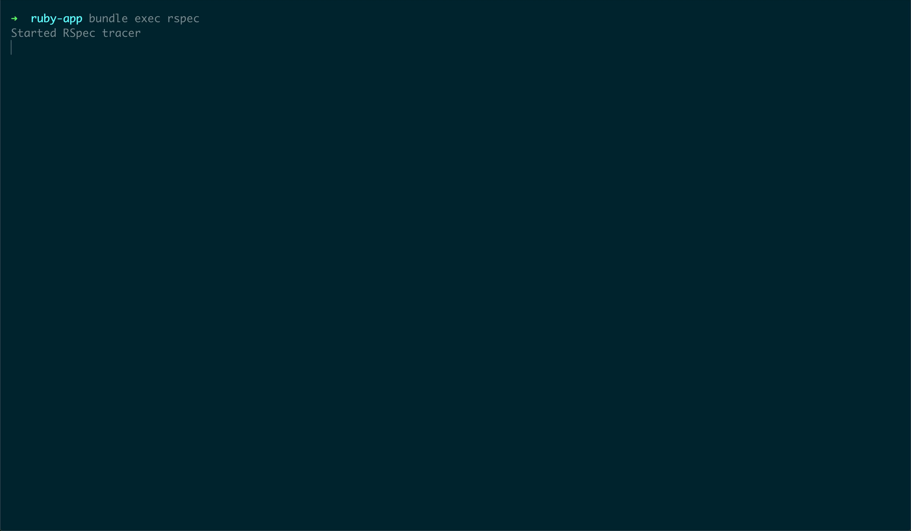
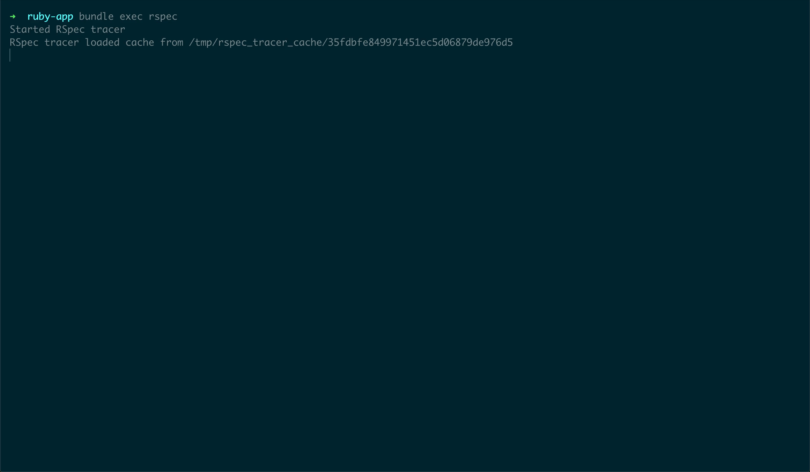
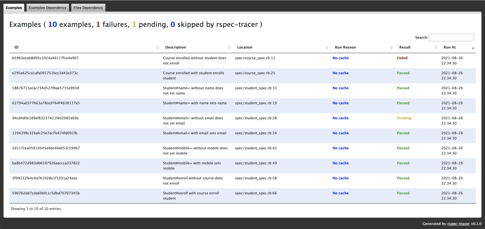
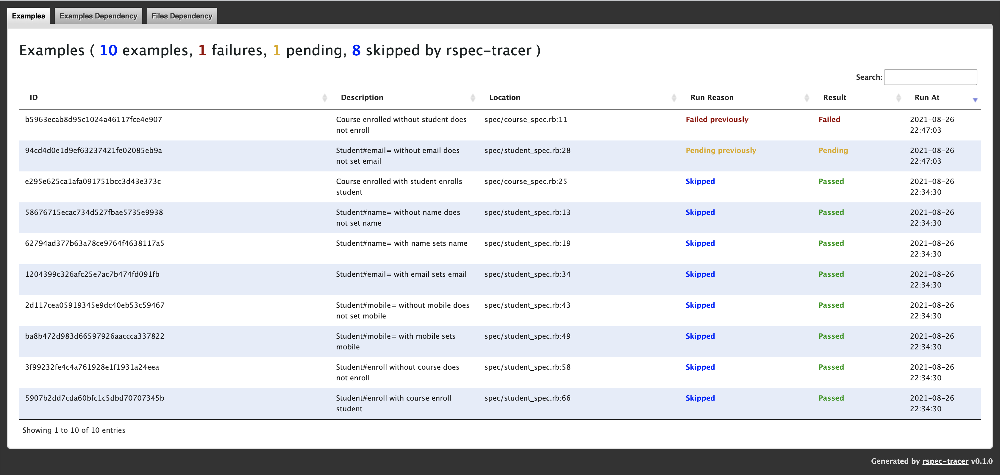
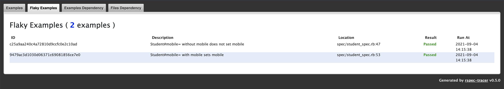
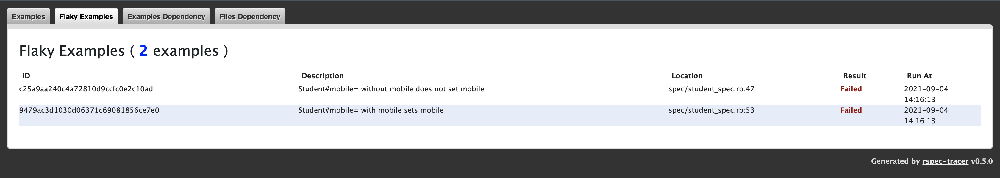
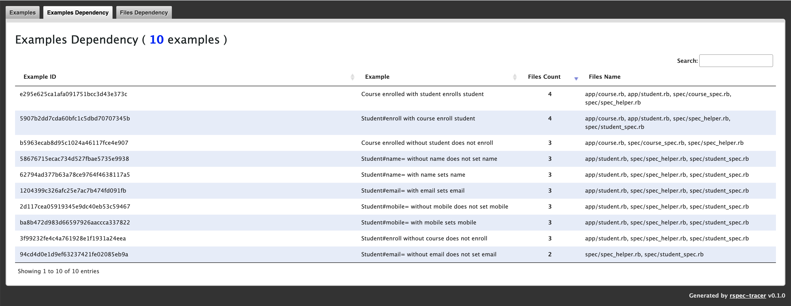
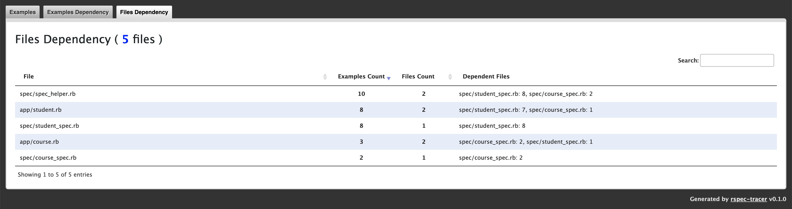

RSpec Tracer is a **specs dependency analyzer**, **flaky tests detector**, **tests accelerator**,
and **coverage reporter** tool. It maintains a list of files for each test, enabling
itself to skip tests in the subsequent runs if none of the dependent files are changed.

It uses [Ruby's built-in coverage library](https://ruby-doc.org/stdlib/libdoc/coverage/rdoc/Coverage.html)
to keep track of the coverage for each test. For each test executed, the coverage
diff provides the desired file list. RSpec Tracer takes care of reporting the
**correct code coverage when skipping tests** by using the cached reports. Also,
note that it will **never skip**:

- **Flaky examples**
- **Failed examples**
- **Pending examples**

Knowing the examples and files dependency gives us a better insight into the codebase,
and we have **a clear idea of what to test for when making any changes**. With this data,
we can also analyze the coupling between different components and much more.

RSpec Tracer requires **Ruby 2.5+** and **rspec-core >= 3.6.0**. To use with **Rails 5+**,
make sure to use **rspec-rails >= 4.0.0**. If you are using SimpleCov, it is
recommended to use **simplecov >= 0.12.0**. To use RSpec Tracer **cache on CI**, you
need to have an **S3 bucket** and **[AWS CLI](https://aws.amazon.com/cli/)**
installed.

You should take some time and go through the **[document](./RSPEC_TRACER.md)**
describing the **intention** and implementation details of **managing dependency**,
**managing flaky tests**, **skipping tests**, and **caching on CI**.

## Table of Contents

* [Demo](#demo)
* [Getting Started](#getting-started)
* [Configuring CI Caching](#configuring-ci-caching)
* [Advanced Configuration](#advanced-configuration)
* [Filters](#filters)
* [Environment Variables](#environment-variables)

## Demo

**First Run**


**Next Run**


You get the following three reports:

### All Examples Report

These reports provide basic test information:

**First Run**



**Next Run**



### Flaky Examples Report

These reports provide flaky tests information. Assuming **the following two tests
failed in the first run.**

**Next Run**



**Another Run**



### Examples Dependency Report

These reports show a list of dependent files for each test.



### Files Dependency Report

These reports provide information on the total number of tests that will run after changing this particular file.




## Getting Started

1. Add this line to your `Gemfile` and `bundle install`:
    ```ruby
    gem 'rspec-tracer', '~> 0.7', group: :test, require: false
    ```

    And, add the followings to your `.gitignore`:
    ```
    /rspec_tracer_cache/
    /rspec_tracer_coverage/
    /rspec_tracer_report/
    ```
2. Load and launch RSpec Tracer at the very top of `spec_helper.rb` (or `rails_helper.rb`,
`test/test_helper.rb`). Note that `RSpecTracer.start` must be issued **before loading
any of the application code.**

    ```ruby
    # Load RSpec Tracer
    require 'rspec_tracer'
    RSpecTracer.start
    ```

    **If you are using SimpleCov**, load RSpec Tracer right after the SimpleCov load
    and launch:

    ```ruby
    require 'simplecov'
    SimpleCov.start

    # Load RSpec Tracer
    require 'rspec_tracer'
    RSpecTracer.start
    ```

    Currently using RSpec Tracer with SimpleCov has the following two limitations:

    - SimpleCov **won't be able to provide branch coverage report** even when enabled.
    - RSpec Tracer **nullifies the `SimpleCov.at_exit`** callback.

3. After running your tests, open `rspec_tracer_report/index.html` in the browser
of your choice.

## Configuring CI Caching

To enable RSpec Tracer to share cache between different builds on CI, update the
Rakefile in your project to have the following:
```ruby
spec = Gem::Specification.find_by_name('rspec-tracer')

load "#{spec.gem_dir}/lib/rspec_tracer/remote_cache/Rakefile"
```

Before running tests, download the remote cache using the following rake task:
```sh
bundle exec rake rspec_tracer:remote_cache:download
```

After running tests, upload the local cache using the following rake task:
```sh
bundle exec rake rspec_tracer:remote_cache:upload
```

You must set the following two environment variables:

- **`GIT_BRANCH`** is the git branch name you are running the CI build on.
- **`RSPEC_TRACER_S3_URI`** is the S3 bucket path to store the cache files.
  ```sh
  export RSPEC_TRACER_S3_URI=s3://ci-artifacts-bucket/rspec-tracer-cache
  ```

## Advanced Configuration

Configuration settings can be applied in three formats, which are completely equivalent:

- The most common way is to configure it directly in your start block:
  ```ruby
  RSpecTracer.start do
    config_option 'foo'
  end
  ```
- You can also set all configuration options directly:
  ```ruby
  RSpecTracer.config_option 'foo'
  ```

- If you do not want to start tracer immediately after launch or want to add
additional configuration later on in a concise way, use:
  ```ruby
  RSpecTracer.configure do
    config_option 'foo'
  end
  ```

The available configuration options are:

- **`root dir`** to set the project root. The default value is the current working
directory.
- **`add_filter filter`** to apply [filters](#filters) on the source files to
exclude them from the dependent files list.
- **`filters.clear`** to remove the default configured dependent files filters.
- **`add_coverage_filter filter`** to apply [filters](#filters) on the source files
to exclude them from the coverage report.
- **`coverage_filters.clear`** to remove the default configured coverage files filters.
- **`coverage_track_files glob`** to include files in the given glob pattern in
the coverage report if these files are not already present.

```ruby
RSpecTracer.start do
  # Configure project root
  root '/tmp/my_project'

  # Clear existing filters
  filters.clear
  # Add dependent files filter
  add_filter %r{^/tasks/}

  # Clear existing coverage filters
  coverage_filters.clear
  # Add coverage files filter
  add_coverage_filter %w[/features/ /spec/ /tests/]

  # Define glob to track files in the coverage report
  coverage_track_files '{app,lib}/**/*.rb'
end
```

You can configure the RSpec Tracer reports directories using the following environment
variables:

- **`RSPEC_TRACER_CACHE_DIR`** to update the default cache directory (`rspec_tracer_cache`).
  ```sh
  export RSPEC_TRACER_CACHE_DIR=/tmp/rspec_tracer_cache
  ```
- **`RSPEC_TRACER_COVERAGE_DIR`** to update the default coverage directory (`rspec_tracer_coverage`).
  ```sh
  export RSPEC_TRACER_CACHE_DIR=/tmp/rspec_tracer_coverage
  ```
- **`RSPEC_TRACER_REPORT_DIR`** to update the default html reports directory (`rspec_tracer_report`).
  ```sh
  export RSPEC_TRACER_CACHE_DIR=/tmp/rspec_tracer_report
  ```

These settings are available through environment variables because the rake tasks
to download and upload the cache files need to use the same directories.

## Filters

By default, RSpec Tracer ignores all the files outside of the project root directory -
otherwise you would end up with the source files in the gems you are using in the
project. It also applies the following filters:
```ruby
RSpecTracer.configure do
  add_filter '/vendor/bundle/'

  add_coverage_filter %w[
    /autotest/
    /features/
    /spec/
    /test/
    /vendor/bundle/
  ].freeze
end
```

### Defining Custom Filteres

You can currently define a filter using either a String or Regexp (that will then
be Regexp-matched against each source file's path), a block or by passing in your
own Filter class.

#### String Filter

```ruby
RSpecTracer.start do
  add_filter '/helpers/'
end
```

This simple string filter will remove all files that match "/helpers/" in their path.

#### Regex Filter

```ruby
RSpecTracer.start do
  add_filter %r{^/helpers/}
end
```

This simple regex filter will remove all files that start with /helper/ in their path.

#### Block Filter

```ruby
RSpecTracer.start do
  add_filter do |source_file|
    source_file[:file_path].include?('/helpers/')
  end
end
```

Block filters receive a `Hash` object and expect your block to return either true
(if the file is to be removed from the result) or false (if the result should be kept).
In the above example, the filter will remove all files that match "/helpers/" in their path.

#### Array Filter

```ruby
RSpecTracer.start do
  add_filter ['/helpers/', %r{^/utils/}]
end
```

You can pass in an array containing any of the other filter types.

## Environment Variables

To get better control on execution, you can use the following environment variables
whenever required.

- **`LOCAL_AWS (default: false)`:** In case you want to test out the caching feature in the local
development environment. You can install [localstack](https://github.com/localstack/localstack)
and [awscli-local](https://github.com/localstack/awscli-local) and then invoke the
rake tasks with `LOCAL_AWS=true`.

- **`RSPEC_TRACER_NO_SKIP (default: false)`:** Use this environment variables to
not skip any tests. Note that it will continue to maintain cache files and generate
reports.

- **`RSPEC_TRACER_UPLOAD_LOCAL_CACHE (default: false)`:** By default, RSpec Tracer
does not upload local cache files. You can set this environment variable to `true`
to upload the local cache to S3.

- **`RSPEC_TRACER_VERBOSE (default: false)`:** To print the intermediate steps
and time taken, use this environment variable.

- **`TEST_SUITES`:** Set this environment variable when running parallel builds
in the CI. It determines the total number of different test suites you are running.
  ```sh
  export TEST_SUITES=8
  ```

- **`TEST_SUITE_ID`:** If you have a large set of tests to run, it is recommended
to run them in separate groups. This way, RSpec Tracer is not overwhelmed with
loading massive cached data in the memory. Also, it generates and uses cache for
specific test suites and not merge them.
  ```sh
  TEST_SUITE_ID=1 bundle exec rspec spec/models
  TEST_SUITE_ID=2 bundle exec rspec spec/helpers
  ```

## Contributing

Read the [contribution guide](https://github.com/avmnu-sng/rspec-tracer/blob/main/.github/CONTRIBUTING.md).

## License

The gem is available as open source under the terms of the [MIT License](https://opensource.org/licenses/MIT).

## Code of Conduct

Everyone interacting in the Rspec Tracer project's codebases, issue trackers, chat rooms and mailing lists is expected to follow the [Code of Conduct](https://github.com/avmnu-sng/rspec-tracer/blob/main/.github/CODE_OF_CONDUCT.md).
