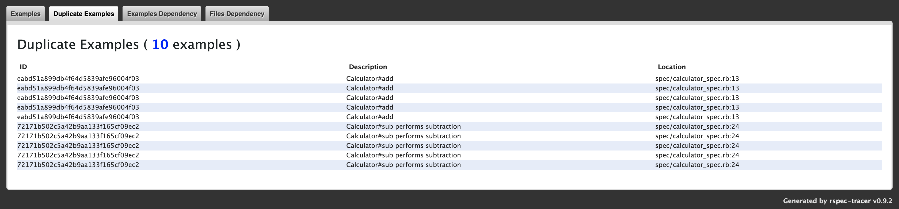

[](https://www.codetriage.com/avmnu-sng/rspec-tracer)
[](https://discord.gg/H2G9yWeuRZ)
[](https://codeclimate.com/github/avmnu-sng/rspec-tracer/maintainability)
[](https://codeclimate.com/github/avmnu-sng/rspec-tracer/test_coverage)
[](https://badge.fury.io/rb/rspec-tracer)


RSpec Tracer is a **specs dependency analyzer**, **flaky tests detector**, **tests accelerator**,
and **coverage reporter** tool. It maintains a list of files for each test, enabling
itself to skip tests in the subsequent runs if none of the dependent files are changed.

It uses [Ruby's built-in coverage library](https://ruby-doc.org/stdlib/libdoc/coverage/rdoc/Coverage.html)
to keep track of the coverage for each test. For each test executed, the coverage
diff provides the desired file list. RSpec Tracer takes care of reporting the
**correct code coverage when skipping tests** by using the cached reports. Also,
note that it will **never skip**:

- **Flaky examples**
- **Failed examples**
- **Pending examples**

Knowing the examples and files dependency gives us a better insight into the codebase,
and we have **a clear idea of what to test for when making any changes**. With this data,
we can also analyze the coupling between different components and much more.

RSpec Tracer requires **Ruby 2.5+** and **rspec-core >= 3.6.0**. To use with **Rails 5+**,
make sure to use **rspec-rails >= 4.0.0**. If you are using SimpleCov, it is
recommended to use **simplecov >= 0.17.0**. To use RSpec Tracer **cache on CI**, you
need to have an **S3 bucket** and **[AWS CLI](https://aws.amazon.com/cli/)**
installed.

> You should take some time and go through the **[document](./RSPEC_TRACER.md)**
describing the **intention** and implementation details of **managing dependency**,
**managing flaky tests**, **skipping tests**, and **caching on CI**.

## Table of Contents

* [Getting Started](#getting-started)
  * [Working with JRuby](#working-with-jruby)
  * [Working with Parallel Tests](#working-with-parallel-tests)
* [Configuring CI](#configuring-ci-caching)
* [Advanced Configuration](#advanced-configuration)
  * [Available Settings](#available-settings)
* [Filters](#filters)
* [Duplicate Examples](#duplicate-examples)
* [Demo](#demo)

## Getting Started

1. Add this line to your `Gemfile` and `bundle install`:
    ```ruby
    gem 'rspec-tracer', '~> 1.0', group: :test, require: false
    ```

    And, add the followings to your `.gitignore`:
    ```
    rspec_tracer.lock
    rspec_tracer_cache/
    rspec_tracer_coverage/
    rspec_tracer_report/
    ```
2. Load and launch RSpec Tracer at the very top of `spec_helper.rb` (or `rails_helper.rb`,
`test/test_helper.rb`). Note that `RSpecTracer.start` must be issued **before loading
any of the application code.**

    ```ruby
    # Load RSpec Tracer
    require 'rspec_tracer'
    RSpecTracer.start
    ```

    **If you are using SimpleCov**, load RSpec Tracer right after the SimpleCov load
    and launch:

    ```ruby
    require 'simplecov'
    SimpleCov.start

    # Load RSpec Tracer
    require 'rspec_tracer'
    RSpecTracer.start
    ```

    If you use RSpec Tracer with SimpleCov, then **SimpleCov would not report branch
    coverage results even when enabled**.

3. After running your tests, open `rspec_tracer_report/index.html` in the browser
of your choice.

### Working with JRuby

It is recommend to use **JRuby 9.2.10.0+**. Also, configure it with **`JRUBY_OPTS="--debug -X+O"`**
or have the `.jrubyrc` file:

```ruby
debug.fullTrace=true
objectspace.enabled=true
```

### Working with Parallel Tests

The Rspec tracer, by default, supports working with [parallel_tests](https://github.com/grosser/parallel_tests/)
gem. It maintains a lock file `rspec_tracer.lock` to identify the last
running process. Usually, you are not required to do anything special unless you
interrupt the execution in between and the process did not complete correctly.
In such a case, you must delete the lock file before the next run.

```sh
rm -f rspec_tracer.lock && bundle exec parallel_rspec
```

## Configuring CI

To enable RSpec Tracer to share cache between different builds on CI, update the
Rakefile in your project to have the following:
```ruby
spec = Gem::Specification.find_by_name('rspec-tracer')

load "#{spec.gem_dir}/lib/rspec_tracer/remote_cache/Rakefile"
```

Before running tests, download the remote cache using the following rake task:
```sh
bundle exec rake rspec_tracer:remote_cache:download
```

After running tests, upload the local cache using the following rake task:
```sh
bundle exec rake rspec_tracer:remote_cache:upload
```

You must set the following environment variables:

- **`GIT_BRANCH`** is the git branch name you are running the CI build on.

- **`TEST_SUITES`** is the total number of different test suites you are running.
  ```sh
  export TEST_SUITES=8
  ```

- **`TEST_SUITE_ID`** is the CI build ID. If you have a large set of tests to run,
it is recommended to run them in separate groups. This way, RSpec Tracer is not
overwhelmed with loading massive cached data in the memory. Also, it generates and
uses cache for specific test suites and not merge them.
  ```sh
  TEST_SUITE_ID=1 bundle exec rspec spec/models
  TEST_SUITE_ID=2 bundle exec rspec spec/helpers
  ```

## Advanced Configuration

Configuration settings must be defined in **`.rspec-tracer`** file:
```ruby
RSpecTracer.configure do
  config_option 'foo'
end
```

You can additionally define a global config file `~/.rspec-tracer` to share the
common settings across projects.

### Available Settings

- **`root dir`** to set the project root. The default value is the current working
directory.

- **`project_name name`** to set the project name. The default value is the last
part of the project root directory.

- **`cache_dir dir`** to set the cache directory. The default value is `./rspec_tracer_cache`.
You can also set the **`RSPEC_TRACER_CACHE_DIR`** environment variable.

- **`coverage_dir dir`** to set the coverage reports directory. The default is the
`./rspec_tracer_coverage`. You can also set the **`RSPEC_TRACER_COVERAGE_DIR`**
environment variable.

- **`report_dir dir`** to set the HTML reports directory. The default is the
`./rspec_tracer_report`.  You can also set the **`RSPEC_TRACER_REPORT_DIR`**
environment variable.

- **`reports_s3_path uri`** to set the AWS S3 URI for all the reports from the current
run. You can also set the **`RSPEC_TRACER_REPORTS_S3_PATH`** environment variable.

- **`use_local_aws bool_flag`** to use the `awslocal` AWS CLI with `LocalStack`. You can
also set the **`RSPEC_TRACER_USE_LOCAL_AWS`** environment variable.

- **`upload_non_ci_reports bool_flag`** to upload execution reports in a non-CI
environment. You can also set the **`RSPEC_TRACER_UPLOAD_NON_CI_REPORTS`** environment
variable.

- **`run_all_examples bool_flag`** to always run all the examples irrespective of cache.
You can also set the **`RSPEC_TRACER_RUN_ALL_EXAMPLES`** environment variable.

- **`fail_on_duplicates bool_flag`** to fail with a non-zero exit code in case of
duplicate examples. You can also set the **`RSPEC_TRACER_FAIL_ON_DUPLICATES`** environment
variable.

- **`lock_file file`** to set the lock file when executing with `parallel_tests`. The default
value is `./rspec_tracer.lock`. You can also set the **`RSPEC_TRACER_LOCK_FILE`** environment
variable.

- **`log_level level`** to set the log level. The default value is `warn`. The possible
values are `off`, `debug`, `info`, `warn`, and `error`. You can also set the
**`RSPEC_TRACER_LOG_LEVEL`** environment variable.

- **`add_filter filter`** to apply filters on the source files to exclude them
from the dependent files list.

- **`filters.clear`** to remove the configured dependent files filters so far.

- **`add_coverage_filter filter`** to apply filters on the source files to exclude
them from the coverage report.

- **`coverage_filters.clear`** to remove the configured coverage files filters so far.

- **`coverage_track_files glob`** to include files in the given glob pattern in
the coverage report if these files are not already present.

```ruby
RSpecTracer.configure do
  # Configure project root
  root '/tmp/my_project'

  # Clear existing filters
  filters.clear
  # Add dependent files filter
  add_filter %r{^/tasks/}

  # Clear existing coverage filters
  coverage_filters.clear
  # Add coverage files filter
  add_coverage_filter %w[/features/ /spec/ /tests/]

  # Define glob to track files in the coverage report
  coverage_track_files '{app,lib}/**/*.rb'
end
```

## Filters

By default, RSpec Tracer ignores all the files outside of the project root directory -
otherwise you would end up with the source files in the gems you are using in the
project. It also applies the following filters:
```ruby
RSpecTracer.configure do
  log_level 'warn'

  add_filter '/vendor/bundle/'

  add_coverage_filter %w[
    /autotest/
    /features/
    /spec/
    /test/
    /vendor/bundle/
  ].freeze
end
```

### Defining Custom Filteres

You can currently define a filter using either a String or Regexp (that will then
be Regexp-matched against each source file's name relative to the project root),
a block or by passing in your own Filter class.

- **String Filter**: The string filter matches files that have the given string
in their name. For example, the following string filter will remove all files that
have `"/helpers/"` in their name.
  ```ruby
  RSpecTracer.configure do
    add_filter '/helpers/'
  end
  ```

- **Regex Filter**: The regex filter removes all files that have a successful name
match against the given regex expression. This simple regex filter will remove
all files that start with `%r{^/helper/}` in their name:
  ```ruby
  RSpecTracer.configure do
    add_filter %r{^/helpers/}
  end
  ```

- **Block Filter**: Block filters receive a `Hash` object and expect your block
to return either **true** (if the file is to be removed from the result) or **false**
(if the result should be kept). In the below example, the filter will remove all
files that match `"/helpers/"` in their path.
  ```ruby
  RSpecTracer.configure do
    add_filter do |source_file|
      source_file[:file_path].include?('/helpers/')
    end
  end
  ```

  You can also use `source_file[:name]` to define the return value of the block
  filter for the given source file.

- **Array Filter**: You can pass in an array containing any of the other filter types:
  ```ruby
  RSpecTracer.configure do
    add_filter ['/helpers/', %r{^/utils/}]
  end
  ```

## Duplicate Examples

To uniquely identify the examples is one of the requirements for the correctness
of the RSpec Tracer. Sometimes, it would not be possible to do so depending upon
how we have written the specs. The following attributes determine the uniqueness:

- The example group
- The example full description
- The spec file location, i.e., file name and line number
- All the shared examples and contexts

Consider the following `Calculator` module:
```ruby
module Calculator
  module_function

  def add(a, b) a + b; end
  def sub(a, b) a - b; end
  def mul(a, b) a * b; end
end
```

And the corresponding spec file `spec/calculator_spec.rb`:
```ruby
RSpec.describe Calculator do
  describe '#add' do
    [
      [1, 2, 3],
      [0, 0, 0],
      [5, 32, 37],
      [-1, -8, -9],
      [10, -10, 0]
    ].each { |a, b, r| it { expect(described_class.add(a, b)).to eq(r) } }
  end

  describe '#sub' do
    [
      [1, 2, -1],
      [10, 0, 10],
      [37, 5, 32],
      [-1, -8, 7],
      [10, 10, 0]
    ].each do |a, b, r|
      it 'performs subtraction' do
        expect(described_class.sub(a, b)).to eq(r)
      end
    end
  end

  describe '#mul' do
    [
      [1, 2, -2],
      [10, 0, 0],
      [5, 7, 35],
      [-1, -8, 8],
      [10, 10, 100]
    ].each do |a, b, r|
      it "multiplies #{a} and #{b} to #{r}" do
        expect(described_class.mul(a, b)).to eq(r)
      end
    end
  end
end
```

Running the spec with `bundle exec rspec spec/calculator_spec.rb` generates the
following output:
```
Calculator
  #mul
    multiplies 5 and 7 to 35
    multiplies 10 and 10 to 100
    multiplies 10 and 0 to 0
    multiplies 1 and 2 to -2 (FAILED - 1)
    multiplies -1 and -8 to 8
  #add
    example at ./spec/calculator_spec.rb:13
    example at ./spec/calculator_spec.rb:13
    example at ./spec/calculator_spec.rb:13
    example at ./spec/calculator_spec.rb:13
    example at ./spec/calculator_spec.rb:13
  #sub
    performs subtraction
    performs subtraction
    performs subtraction
    performs subtraction
    performs subtraction
```

In this scenario, RSpec Tracer cannot determine the `Calculator#add` and
`Calculator#sub` group examples.

```
================================================================================
   IMPORTANT NOTICE -- RSPEC TRACER COULD NOT IDENTIFY SOME EXAMPLES UNIQUELY
================================================================================
RSpec tracer could not uniquely identify the following 10 examples:
  - Example ID: eabd51a899db4f64d5839afe96004f03 (5 examples)
      * Calculator#add (spec/calculator_spec.rb:13)
      * Calculator#add (spec/calculator_spec.rb:13)
      * Calculator#add (spec/calculator_spec.rb:13)
      * Calculator#add (spec/calculator_spec.rb:13)
      * Calculator#add (spec/calculator_spec.rb:13)
  - Example ID: 72171b502c5a42b9aa133f165cf09ec2 (5 examples)
      * Calculator#sub performs subtraction (spec/calculator_spec.rb:24)
      * Calculator#sub performs subtraction (spec/calculator_spec.rb:24)
      * Calculator#sub performs subtraction (spec/calculator_spec.rb:24)
      * Calculator#sub performs subtraction (spec/calculator_spec.rb:24)
      * Calculator#sub performs subtraction (spec/calculator_spec.rb:24)
```

## Demo

**First Run**


**Next Run**


You get the following three reports:

### All Examples Report

These reports provide basic test information:

**First Run**


**Next Run**


### Duplicate Examples Report

These reports provide duplicate tests information.



### Flaky Examples Report

These reports provide flaky tests information. Assuming **the following two tests
failed in the first run.**

**Next Run**


**Another Run**


### Examples Dependency Report

These reports show a list of dependent files for each test.


### Files Dependency Report

These reports provide information on the total number of tests that will run after changing this particular file.


## Contributing

Read the [contribution guide](https://github.com/avmnu-sng/rspec-tracer/blob/main/.github/CONTRIBUTING.md).

## License

The gem is available as open source under the terms of the [MIT License](https://opensource.org/licenses/MIT).

## Code of Conduct

Everyone interacting in the Rspec Tracer project's codebases, issue trackers, chat rooms and mailing lists is expected to follow the [Code of Conduct](https://github.com/avmnu-sng/rspec-tracer/blob/main/.github/CODE_OF_CONDUCT.md).
