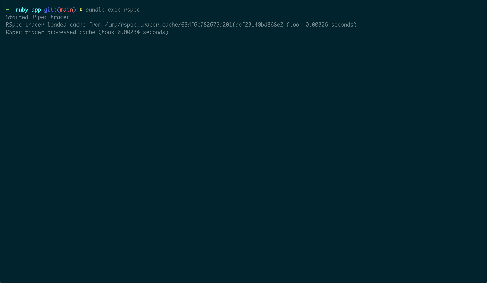

RSpec Tracer is a **specs dependency analysis tool** and a **test skipper for RSpec**.
It maintains a list of files for each test, enabling itself to skip tests in the
subsequent runs if none of the dependent files are changed.

It uses [Ruby's built-in coverage library](https://ruby-doc.org/stdlib/libdoc/coverage/rdoc/Coverage.html)
to keep track of the coverage for each test. For each test executed, the coverage
diff provides the desired file list. RSpec Tracer takes care of reporting the
**correct code coverage when skipping tests** by using the cached reports. Also,
note that it will **never skip any tests which failed or were pending** in the last runs.

Knowing the examples and files dependency gives us a better insight into the codebase,
and we have **a clear idea of what to test for when making any changes**. With this data,
we can also analyze the coupling between different components and much more.

**First Run**


**Next Run**


## Note

**RSpec Tracer is currently available for use in the local development
environment only.**

## Installation

Add this line to your `Gemfile` and `bundle install`:
```ruby
gem 'rspec-tracer', group: :test, require: false
```

And, add the followings to your `.gitignore`:
```
/rspec_tracer_cache/
/rspec_tracer_coverage/
/rspec_tracer_report/
```

### Compatibility

RSpec Tracer requires **Ruby 2.5+** and **rspec-core >= 3.6.0**. If you are using
SimpleCov, it is recommended to use **simplecov >= 0.12.0**.

## Getting Started

1. **Load and Start RSpec Tracer**

    - **With SimpleCov**

        If you are using `SimpleCov`, load RSpec Tracer right after the SimpleCov load
        and launch:

        ```ruby
        require 'simplecov'
        SimpleCov.start

        # Load RSpec Tracer
        require 'rspec-tracer'
        RSpecTracer.start
        ```

        Currently using RSpec Tracer with SimpleCov has the following two limitations:
        - SimpleCov **won't be able to provide branch coverage report** even when enabled.
        - RSpec Tracer **nullifies the `SimpleCov.at_exit`** callback.

    - **Without SimpleCov**

        Load and launch RSpec Tracer at the very top of `spec_helper.rb` (or `rails_helper.rb`,
        `test/test_helper.rb`). Note that `RSpecTracer.start` must be issued **before loading
        any of the application code.**

        ```ruby
        # Load RSpec Tracer
        require 'rspec-tracer'
        RSpecTracer.start
        ```

2. Run the tests with RSpec using `bundle exec rspec`.
3. After running your tests, open `rspec_tracer_report/index.html` in the
browser of your choice.

## Environment Variables

To get better control on execution, you can use the following two environment variables:

### RSPEC_TRACER_NO_SKIP

The default value is `false.` If set to `true`, the RSpec Tracer will not skip
any tests. Note that it will continue to maintain cache files and generate reports.

```ruby
RSPEC_TRACER_NO_SKIP=true bundle exec rspec
```

### TEST_SUITE_ID

If you have a large set of tests to run, it is recommended to run them in
separate groups. This way, RSpec Tracer is not overwhelmed with loading massive
cached data in the memory. Also, it generate and use cache for specific test suites
and not merge them.

```ruby
TEST_SUITE_ID=1 bundle exec rspec spec/models
TEST_SUITE_ID=2 bundle exec rspec spec/helpers
```

## Sample Reports

You get the following three reports:

### Examples

These reports provide basic test information:

**First Run**


**Next Run**


### Examples Dependency

These reports show a list of dependent files for each test.


### Files Dependency

These reports provide information on the total number of tests that will run after changing this particular file.


## Configuring RSpec Tracer

Configuration settings can be applied in three formats, which are completely equivalent:

- The most common way is to configure it directly in your start block:

    ```ruby
    RSpecTracer.start do
      config_option 'foo'
    end
    ```
- You can also set all configuration options directly:

    ```ruby
    RSpecTracer.config_option 'foo'
    ```

- If you do not want to start tracer immediately after launch or want to add
additional configuration later on in a concise way, use:

    ```ruby
    RSpecTracer.configure do
      config_option 'foo'
    end
    ```

## Filters

RSpec Tracer supports two types of filters:

- To exclude selected files from the dependency list of tests:

    ```ruby
    RSpecTracer.start do
      add_filter %r{^/helpers/}
    end
    ```
- To exclude selected files from the coverage data. You should only use this
when not using SimpleCov.

    ```ruby
    RSpecTracer.start do
      add_coverage_filter %r{^/tasks/}
    end
    ```

By default, a filter is applied that removes all files OUTSIDE of your project's
root directory - otherwise you'd end up with the source files in the gems you are
using as tests dependency.

### Defining Custom Filteres

You can currently define a filter using either a String or Regexp (that will then
be Regexp-matched against each source file's path), a block or by passing in your
own Filter class.

#### String Filter

```ruby
RSpecTracer.start do
  add_filter '/helpers/'
end
```

This simple string filter will remove all files that match "/helpers/" in their path.

#### Regex Filter

```ruby
RSpecTracer.start do
  add_filter %r{^/helpers/}
end
```

This simple regex filter will remove all files that start with /helper/ in their path.

#### Block Filter

```ruby
RSpecTracer.start do
  add_filter do |source_file|
    source_file[:file_path].include?('/helpers/')
  end
end
```

Block filters receive a `Hash` object and expect your block to return either true
(if the file is to be removed from the result) or false (if the result should be kept).
In the above example, the filter will remove all files that match "/helpers/" in their path.

#### Array Filter

```ruby
RSpecTracer.start do
  add_filter ['/helpers/', %r{^/utils/}]
end
```

You can pass in an array containing any of the other filter types.

## Contributing

Read the [contribution guide](https://github.com/avmnu-sng/rspec-tracer/blob/main/.github/CONTRIBUTING.md).

## License

The gem is available as open source under the terms of the [MIT License](https://opensource.org/licenses/MIT).

## Code of Conduct

Everyone interacting in the Rspec Tracer project's codebases, issue trackers, chat rooms and mailing lists is expected to follow the [Code of Conduct](https://github.com/avmnu-sng/rspec-tracer/blob/main/.github/CODE_OF_CONDUCT.md).
